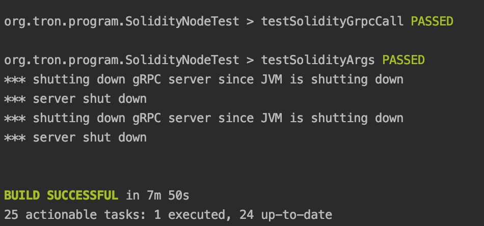

# 使用IDEA运行我们的节点

该文档旨在方便有一定经验的开发者在集成开发环境IDEA中运行我们的节点
 
**以下内容针对当前master分支**
## 一、配置集成开发环境IDEA
**IDEA配置**
- Oracle JDK 1.8 **当前不支持OpenJDK**
- 安装Lombok插件


- 将Compiler下Annotation Processors中的Enable annotation processing前打勾


## 二、部署指南
**1.创建目录**
_/deploy_

```swift
mkdir deploy
```

**2.克隆最新的代码https://github.com/tronprotocol/java-tron 到上述目录**

```swift
git clone https://github.com/tronprotocol/java-tron
```

**3.切换master分支**

```swift
cd java-tron
git checkout -t origin/master
```

**4.编译代码**

```swift
./gradlew build
```
编译过程可能需要一定时间，请耐心等待。
若编译成功，你可以看到类似如下块信息：



如果不想执行单元测试任务，可运行如下命令：

```swift
./gradlew build -x test
```

**5.启动FullNode节点**

编译成功后，可通过java-tron/src/main/java/org/tron/program/FullNode.java路径找到主函数文件，启动一个全节点。


启动后可查看日志验证是否启动成功，日志路径为：/deploy/java-tron/logs/tron.log。
若启动成功，可看到如下日志：


使用tail -f /logs/tron.log命令可查看实时日志，如下：


